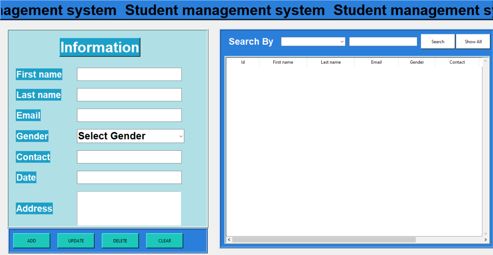

# Student management system
This is the python script to manage multiple students in a database through a graphic user inteface, by using crud operations
# Operations
<ul style="list-style-type:disc"> <li> Create</li>
  <li> Read </li>
  <li> Update </li>
  <li> Delete </li>
  <li> Add </li>
  <li> Search </li>
  <li> Clear </li>
</ul>
<h2> Libraries needed </h2>
<ul style="list-style-type:disc"> 
  <li> <strong>Tkinter</strong>: the standard Python interface to the Tcl/Tk GUI toolkit.
  <li> <strong>Sqlite3</strong>:SQLite is a C library that provides a lightweight disk-based database that doesn’t require a separate server process and allows accessing the database using a nonstandard variant of the SQL query language. 
</ul>

